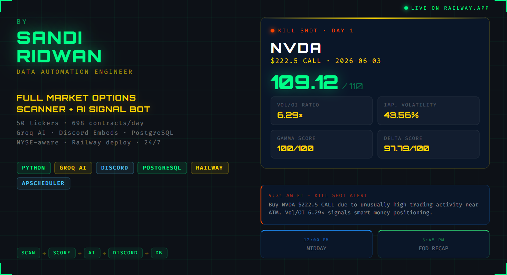

<div align="center">


<br/>


</div>

---

## 📹 Demo

<div align="center">
  <a href="https://youtube.com/watch?v=4KJvm8EluJU">
    
  </a>
  <br/>
  <sub><i>Click to watch — pipeline run, Slack alerts, CSV output walkthrough</i></sub>
</div>

<br/>

<div align="center">
  <video src="0604(1).mp4" 
         width="860" 
         controls 
         autoplay 
         loop 
         muted>
  </video>
</div>


**What you'll see in the demo:**
- 🔍 Scanner fetching 50 tickers live from yfinance
- 📊 Scoring engine ranking 698 contracts in real-time
- 🎯 Kill Shot selected: `NVDA $222.5 CALL` — score `109.12/110`
- 🤖 Groq AI generating signal explanation in < 1 second
- 📨 Discord Embed firing with full analysis card
- 🗄️ PostgreSQL logging the signal automatically

---

## 📋 Overview

A fully automated **0DTE options scanner and AI signal bot** that runs every NYSE trading day on Railway.app. It scans 50 liquid US tickers, scores 698+ options contracts using a custom composite formula, selects the single highest-conviction **Kill Shot**, generates an AI-powered explanation via Groq, and delivers professional Discord Embed alerts — 3 times per trading day.

| Metric | Value |
|---:|:---|
| Tickers Scanned | **50** liquid US equities + ETFs |
| Contracts Processed | **698+** per day |
| Scoring Dimensions | **3** (Delta, Vol/OI, Gamma) + liquidity bonus |
| Kill Shot Score (Day 1) | **109.12 / 110** — NVDA $222.5 CALL |
| Vol/OI Ratio (Day 1) | **6.29x** — massive unusual activity |
| AI Response Time | **< 1 second** (Groq llama-3.3-70b-versatile) |
| Discord Alerts / Day | **3** (9:31 AM · 12:00 PM · 3:45 PM ET) |
| Uptime | **24/7** on Railway.app |
| Market Calendar | **NYSE-aware** — auto-skip weekends + US holidays |
| Database | **PostgreSQL** — signals table + daily_log table |

---

## ⚙️ Architecture

```
Every NYSE Trading Day
         │
         ▼
┌─────────────────┐
│  9:25 AM ET     │
│  SCANNER        │──── yfinance → 50 tickers → 698 contracts
│  scanner.py     │
└────────┬────────┘
         │
         ▼
┌─────────────────┐
│  SCORER         │──── Delta×0.40 + Vol/OI×0.35 + Gamma×0.25 + liquidity_bonus
│  scorer.py      │──── Composite score /110
└────────┬────────┘
         │
         ▼
┌─────────────────┐
│  SIGNAL BOT     │──── Groq AI (llama-3.3-70b-versatile)
│  signal_bot.py  │──── Generate Kill Shot explanation
└────────┬────────┘
         │
    ┌────┴────┐
    ▼         ▼
┌───────┐ ┌───────────┐
│  DB   │ │  DISCORD  │
│  db   │ │  3x/day   │
│  .py  │ │  Embeds   │
└───────┘ └───────────┘
    │
    ▼
PostgreSQL
├── signals (every Kill Shot)
└── daily_log (scan summary)
```

---

## 🏆 Kill Shot Formula

```python
composite_score = (
    delta_score    * 0.40 +   # Proximity to ATM (1.0 moneyness)
    vol_oi_score   * 0.35 +   # Volume/Open Interest ratio (unusual activity)
    gamma_score    * 0.25 +   # IV sweet spot (0.30–0.80)
    liquidity_bonus           # +10.0 if OI>1000 + Vol>500 + spread<10%
)
# Max possible score: 110.0
```

**Day 1 Kill Shot:**
```
Ticker : NVDA
Strike : $222.5 CALL
Expiry : 2026-06-03
Score  : 109.12 / 110
Vol/OI : 6.29x  ← massive unusual activity
IV     : 43.56%
```

---

## 🔧 Technical Challenges Solved

### Challenge 1 — Data Source: Tradier API Error → yfinance Fallback

**Problem:** Client originally specified Tradier for real-time data. Tradier returned `"max accounts"` error immediately on setup. Polygon.io required paid subscription.

**Solution:** Switched to yfinance with curated 50-ticker liquid universe. Client confirmed OK with 15-min delayed data. 49/50 tickers returned successfully.

```python
# Curated 50-ticker liquid universe
TICKER_UNIVERSE = [
    "SPY", "QQQ", "IWM", "NVDA", "AAPL", "MSFT", "TSLA",
    "META", "AMZN", "GOOGL", "AVGO", "AMD", "PLTR", ...
]
```

### Challenge 2 — numpy Types Not Compatible with psycopg2

**Problem:** pandas/numpy produce `np.float64` / `np.int64` — psycopg2 cannot serialize these natively. Error: `schema "np" does not exist`.

**Solution:** Universal `_cast()` helper applied to every value before DB insert.

```python
def _cast(val):
    """Cast numpy types to Python native for psycopg2 compatibility."""
    if hasattr(val, 'item'):
        return val.item()
    return val

# Applied to every insert parameter:
cur.execute("INSERT INTO signals (...) VALUES (%s, %s, ...)", (
    _cast(kill_shot["strike"]),
    _cast(kill_shot["composite_score"]),
    ...
))
```

### Challenge 3 — Railway Container Missing logs/ and data/ Folders

**Problem:** Fresh Railway container has no `logs/` or `data/` directory. `logging.FileHandler` crashes immediately: `FileNotFoundError: /app/logs/main.log`.

**Solution:** `os.makedirs()` called **before** `logging.basicConfig()` — at the very top of `main.py`.

```python
import os

# MUST run before logging setup — Railway container has no folders
os.makedirs("logs", exist_ok=True)
os.makedirs("data", exist_ok=True)

# Only then:
logging.basicConfig(
    handlers=[logging.FileHandler("logs/main.log"), ...]
)
```

### Challenge 4 — NYSE-Aware Scheduling

**Problem:** Bot should not scan on weekends or US market holidays (Thanksgiving, Christmas, etc.).

**Solution:** `pandas_market_calendars` NYSE calendar check at the start of every job.

```python
import pandas_market_calendars as mcal
import pytz

ET = pytz.timezone("America/New_York")
nyse = mcal.get_calendar("NYSE")

def is_market_open_today() -> bool:
    today = datetime.now(ET).strftime("%Y-%m-%d")
    schedule = nyse.schedule(start_date=today, end_date=today)
    return not schedule.empty  # True = market is open
```

---

## 📨 Discord Alert Format

Three alert types per trading day, color-coded:

| Alert | Time (ET) | Color | Content |
|---|---|---|---|
| 🎯 Kill Shot | 9:31 AM | `#FF4500` Orange-red | AI signal + key metrics |
| 📊 Midday Update | 12:00 PM | `#1E90FF` Blue | Top 5 contracts |
| 📋 EOD Recap | 3:45 PM | `#2ECC71` Green | Day summary |

---

## 🗄️ Database Schema

```sql
-- Every Kill Shot logged here
CREATE TABLE signals (
    id               SERIAL PRIMARY KEY,
    created_at       TIMESTAMP DEFAULT NOW(),
    ticker           VARCHAR(10) NOT NULL,
    strike           DECIMAL(10,2) NOT NULL,
    expiry           DATE NOT NULL,
    option_type      VARCHAR(4) NOT NULL,
    composite_score  DECIMAL(6,2),
    delta_score      DECIMAL(6,2),
    vol_oi_score     DECIMAL(6,2),
    gamma_score      DECIMAL(6,2),
    underlying_price DECIMAL(10,2),
    volume           INTEGER,
    open_interest    INTEGER,
    implied_volatility DECIMAL(8,4),
    explanation      TEXT
);

-- Daily scan summary
CREATE TABLE daily_log (
    id                       SERIAL PRIMARY KEY,
    log_date                 DATE DEFAULT CURRENT_DATE UNIQUE,
    total_contracts_scanned  INTEGER,
    total_tickers_scanned    INTEGER,
    top_score                DECIMAL(6,2),
    kill_shot_ticker         VARCHAR(10),
    kill_shot_strike         DECIMAL(10,2),
    kill_shot_type           VARCHAR(4),
    scan_completed_at        TIMESTAMP,
    alerts_sent              INTEGER DEFAULT 0
);
```

---

## 🚀 Quick Start

### Prerequisites
```bash
Python 3.12+
PostgreSQL 16+
Groq API key (free at console.groq.com)
Discord Webhook URL
```

### Installation
```bash
git clone https://github.com/SandiRidwan/option-scanner.git
cd option-scanner
pip install -r requirements.txt
```

### Configuration
```bash
cp .env.example .env
# Fill in your .env:
GROQ_API_KEY=your_groq_key
DISCORD_WEBHOOK=your_discord_webhook_url
DB_HOST=localhost
DB_PORT=5432
DB_NAME=options_scanner
DB_USER=postgres
DB_PASSWORD=yourpassword
DRY_RUN=true          # Set to false for live Discord alerts
TIMEZONE=America/New_York
```

### Database Setup
```bash
psql -U postgres -c "CREATE DATABASE options_scanner;"
psql -U postgres -d options_scanner -f schema.sql
```

### Run
```bash
# Test pipeline manually (no scheduler):
python -c "
from scheduler import job_morning_scan, job_kill_shot_alert
job_morning_scan()
job_kill_shot_alert()
"

# Start full scheduler (runs daily at market hours):
python main.py
```

### Deploy to Railway
```bash
# 1. Push to GitHub
git push origin main

# 2. Railway: New Project → GitHub Repo → add PostgreSQL
# 3. Set environment variables in Railway dashboard
# 4. Set DRY_RUN=false when ready
```

---

## 📁 File Structure

```
option-scanner/
├── .env                      # Environment variables (not committed)
├── .gitignore
├── Procfile                  # Railway: worker: python main.py
├── railway.json              # Railway deploy config
├── requirements.txt
│
├── config.py                 # Dual-mode config (Railway DATABASE_URL / local)
├── scanner.py                # yfinance options chain scanner — 50 tickers
├── scorer.py                 # Composite scoring engine + Kill Shot selector
├── signal_bot.py             # Groq AI explanation generator
├── discord_alert.py          # 3 Discord Embed alert functions
├── database.py               # PostgreSQL insert / upsert / increment
├── scheduler.py              # APScheduler 4 jobs + NYSE calendar check
├── main.py                   # Entry point + health check
│
├── data/                     # Runtime data (not committed)
│   ├── scan_result.csv       # Raw options chain data
│   ├── scored_contracts.csv  # Ranked contracts
│   ├── kill_shot.json        # Today's Kill Shot
│   └── signal_output.json    # AI explanation output
│
└── logs/                     # Runtime logs (not committed)
    ├── scanner.log
    ├── scorer.log
    ├── signal_bot.log
    ├── discord_alert.log
    ├── database.log
    ├── scheduler.log
    └── main.log
```

---

## 🛠️ Tech Stack

| Component | Tool | Version |
|---|---|---|
| Language | Python | 3.14 |
| Options Data | yfinance | 1.4.1 |
| AI Generator | Groq API (llama-3.3-70b-versatile) | 1.4.0 |
| Discord Alerts | discord-webhook | 1.4.1 |
| Database | PostgreSQL + psycopg2-binary | 18.4 / 2.9.12 |
| Scheduler | APScheduler | 3.11.2 |
| Market Calendar | pandas-market-calendars | 5.4.0 |
| Deployment | Railway.app | — |

---

## 👤 Author

<div align="center">


[](https://www.upwork.com/freelancers/sandiridwan)
[](https://linkedin.com/in/sandiridwan)
[](https://github.com/SandiRidwan)

**Specialties:** Python Automation · Web Scraping · AI/LLM Pipelines · Scheduled Bots · PostgreSQL · Railway Deploy

> *"Built and deployed in 1 day. Kill Shot Day 1: NVDA $222.5 CALL — score 109.12/110."*

</div>

---

<div align="center">
<sub>Built with 🎯 by Sandi Ridwan · Deployed on Railway.app · NOT financial advice</sub>
</div>
